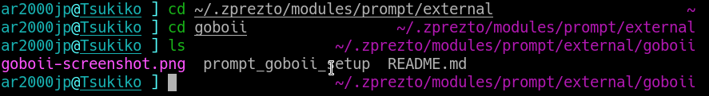

# Goboii
A minimal [Prezto](https://github.com/sorin-ionescu/prezto) Zsh prompt theme inspired by GoboLinux's default theme, among others.

### Install
- cd ~/.zprezto/modules/prompt/external
- git clone https://github.com/Ar2000jp/zsh-prompt-goboii.git goboii
- cd ~/.zprezto/modules/prompt/functions
- ln -s ~/.zprezto/modules/prompt/external/goboii/prompt_goboii_setup
- Add `prompt goboii` to your `~/.zpreztorc`.

The theme's colors can be configured by changing the line in `~/.zpreztorc` to something like:
- `prompt goboii white blue`

The syntax is:
- `prompt goboii [<prompt color> [<path color>]]`

### License

This work is licensed under the MIT License.
